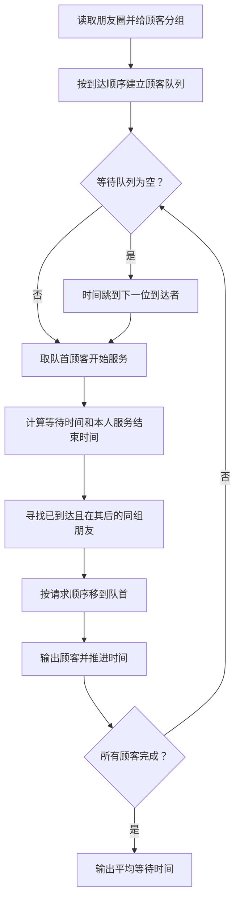
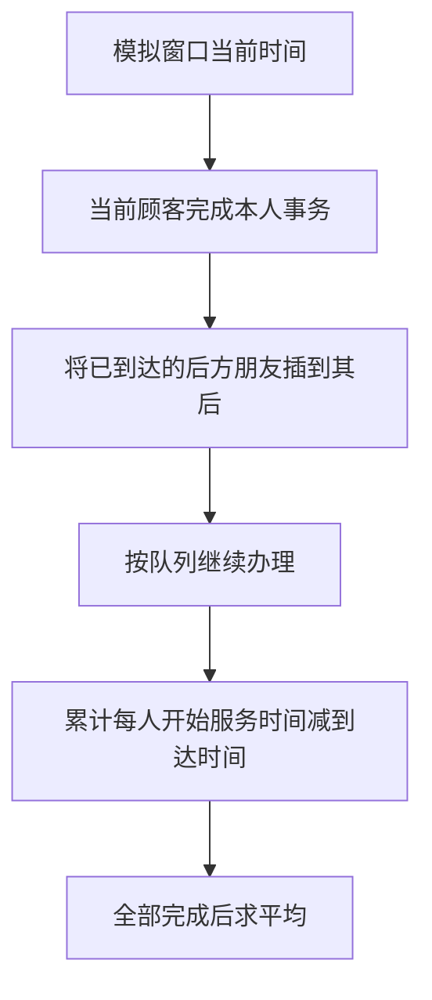

# 7-48 银行排队问题之单窗口“夹塞”版

- **分值：** 30分

## 题目描述

排队“夹塞”是引起大家强烈不满的行为，但是这种现象时常存在。在银行的单窗口排队问题中，假设银行只有1个窗口提供服务，所有顾客按到达时间排成一条长龙。当窗口空闲时，下一位顾客即去该窗口处理事务。此时如果已知第$$i$$位顾客与排在后面的第$$j$$位顾客是好朋友，并且愿意替朋友办理事务的话，那么第$$i$$位顾客的事务处理时间就是自己的事务加朋友的事务所耗时间的总和。在这种情况下，顾客的等待时间就可能被影响。假设所有人到达银行时，若没有空窗口，都会请求排在最前面的朋友帮忙（包括正在窗口接受服务的朋友）；当有不止一位朋友请求某位顾客帮忙时，该顾客会根据自己朋友请求的顺序来依次处理事务。试编写程序模拟这种现象，并计算顾客的平均等待时间。

## 输入格式

输入的第一行是两个整数：$$1\le N \le 10000$$，为顾客总数；$$0 \le M \le 100$$，为彼此不相交的朋友圈子个数。若$$M$$非0，则此后$$M$$行，每行先给出正整数$$2\le L \le 100$$，代表该圈子里朋友的总数，随后给出该朋友圈里的$$L$$位朋友的名字。名字由3个大写英文字母组成，名字间用1个空格分隔。最后$$N$$行给出$$N$$位顾客的姓名、到达时间$$T$$和事务处理时间$$P$$（以分钟为单位），之间用1个空格分隔。简单起见，这里假设顾客信息是按照到达时间先后顺序给出的（有并列时间的按照给出顺序排队），并且假设每个事务最多占用窗口服务60分钟（如果超过则按60分钟计算）。

## 输出格式

按顾客接受服务的顺序输出顾客名字，每个名字占1行。最后一行输出所有顾客的平均等待时间，保留到小数点后1位。

## 输入样例
```
6 2
3 ANN BOB JOE
2 JIM ZOE
JIM 0 20
BOB 0 15
ANN 0 30
AMY 0 2
ZOE 1 61
JOE 3 10

```

## 输出样例
```
JIM
ZOE
BOB
ANN
JOE
AMY
75.2

```

**鸣谢用户 陈君伟 补充数据！**

### 解题思路

按到达顺序维护等待队列，并记录每个顾客的朋友集合。窗口服务当前顾客时，将其后续朋友按请求顺序合并到当前事务；模拟服务完成时间，始终选择队首可服务顾客，累计其等待时间。

### 代码流程说明

1. 读取题目要求的输入并建立必要的数据结构。
2. 按上述算法处理数据，维护中间结果和边界条件。
3. 按题目规定的顺序与格式输出结果。

### 代码实现

```java
// 实现原理：按到达顺序维护等待队列，并记录每个顾客的朋友集合。窗口服务当前顾客时，将其后续朋友按请求顺序合并到当前事务；模拟服务完成时间，始终选择队首可服务顾客，累计其等待时间。
static class Customer {
  String name;
  int arrive, process, group;

  Customer(String name, int arrive, int process, int group) {
    this.name = name;
    this.arrive = arrive;
    this.process = Math.min(process, 60);
    this.group = group;
  }
}

static double averageWait(List<Customer> customers) {
  // 用队列/栈保存尚未处理的元素，保证遍历或模拟的处理顺序。
  // 用队列/栈保存尚未处理的元素，保证遍历或模拟的处理顺序。
// 用队列/栈保存尚未处理的元素，保证遍历或模拟的处理顺序。
// 用队列/栈保存尚未处理的元素，保证遍历或模拟的处理顺序。
  ArrayDeque<Integer> queue = new ArrayDeque<>();
  boolean[] inQueue = new boolean[customers.size()];
  boolean[] done = new boolean[customers.size()];
  int next = 0, current = 0;
  long totalWait = 0;
  while (next < customers.size() || !queue.isEmpty()) {
    while (next < customers.size() && customers.get(next).arrive <= current) {
      if (!done[next] && !inQueue[next]) {
        queue.offer(next);
        inQueue[next] = true;
      }
      next++;
    }
    if (queue.isEmpty()) {
      current = Math.max(current, customers.get(next).arrive);
      continue;
    }
    int index = queue.poll();
    inQueue[index] = false;
    Customer c = customers.get(index);
    int start = Math.max(current, c.arrive);
    totalWait += start - c.arrive;
    int ownEnd = start + c.process;
    done[index] = true;
    List<Integer> friends = new ArrayList<>();
    for (int i = index + 1; i < customers.size(); i++) {
      Customer friend = customers.get(i);
      if (!done[i] && c.group != 0 && friend.group == c.group && friend.arrive <= ownEnd) {
        queue.remove(i);
        inQueue[i] = false;
        friends.add(i);
      }
    }
    for (int i = friends.size() - 1; i >= 0; i--) {
      queue.addFirst(friends.get(i));
      inQueue[friends.get(i)] = true;
    }
    System.out.println(c.name);
    current = ownEnd;
  }
  return totalWait / (double) customers.size();
}
```
### 代码流程图



### 解题流程图



### 复杂度分析

当前实现为保证朋友插队顺序会扫描后续顾客并从队列移除，最坏时间 O(N²)，空间 O(N)。

### 常见易错点

- 处理时间超过 60 要截断；朋友请求顺序必须按到达顺序；服务开始时间不能早于到达时间；平均值使用浮点数并保留 1 位。
- 输入规模较大时，应选择与数据范围匹配的复杂度和数值类型。
- 输出分隔符、换行和特殊结果必须严格遵循题目格式。
