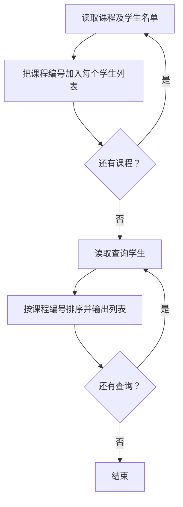
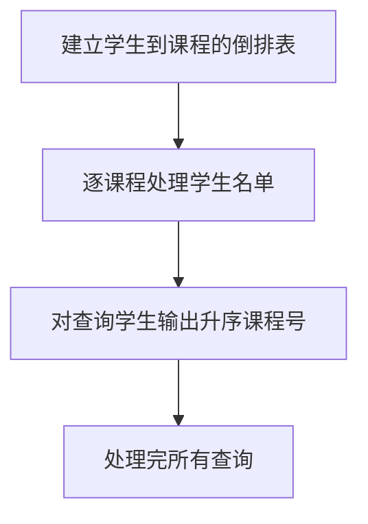

# 7-49 打印学生选课清单

- **分值：** 25分

## 题目描述

假设全校有最多40000名学生和最多2500门课程。现给出每门课的选课学生名单，要求输出每个前来查询的学生的选课清单。注意：每门课程的选课人数不可超过 200 人。

## 输入格式

输入的第一行是两个正整数：N（$$\le$$40000），为前来查询课表的学生总数；K（$$\le$$2500），为总课程数。此后顺序给出课程1到K的选课学生名单。格式为：对每一门课，首先在一行中输出课程编号（简单起见，课程从1到K编号）和选课学生总数（之间用空格分隔），之后在第二行给出学生名单，相邻两个学生名字用1个空格分隔。学生姓名由3个大写英文字母+1位数字组成。选课信息之后，在一行内给出了N个前来查询课表的学生的名字，相邻两个学生名字用1个空格分隔。

## 输出格式

对每位前来查询课表的学生，首先输出其名字，随后在同一行中输出一个正整数C，代表该生所选的课程门数，随后按递增顺序输出C个课程的编号。相邻数据用1个空格分隔，注意行末不能输出多余空格。

## 输入样例
```
10 5
1 4
ANN0 BOB5 JAY9 LOR6
2 7
ANN0 BOB5 FRA8 JAY9 JOE4 KAT3 LOR6
3 1
BOB5
4 7
BOB5 DON2 FRA8 JAY9 KAT3 LOR6 ZOE1
5 9
AMY7 ANN0 BOB5 DON2 FRA8 JAY9 KAT3 LOR6 ZOE1
ZOE1 ANN0 BOB5 JOE4 JAY9 FRA8 DON2 AMY7 KAT3 LOR6
```

## 输出样例
```
ZOE1 2 4 5
ANN0 3 1 2 5
BOB5 5 1 2 3 4 5
JOE4 1 2
JAY9 4 1 2 4 5
FRA8 3 2 4 5
DON2 2 4 5
AMY7 1 5
KAT3 3 2 4 5
LOR6 4 1 2 4 5
```

### 解题思路

建立“学生 → 课程列表”的倒排表。逐门课程读取名单，把课程编号加入对应学生的列表；查询时按课程编号升序输出该学生的所有课程。

### 代码流程说明

1. 读取题目要求的输入并建立必要的数据结构。
2. 按上述算法处理数据，维护中间结果和边界条件。
3. 按题目规定的顺序与格式输出结果。

### 代码实现

```java
static Map<String, List<Integer>> coursesByStudent(
        Map<Integer, List<String>> courseStudents) {
    Map<String, List<Integer>> result = new HashMap<>();
    for (Map.Entry<Integer, List<String>> e : courseStudents.entrySet())
        for (String name : e.getValue())
            result.computeIfAbsent(name, k -> new ArrayList<>()).add(e.getKey());
    for (List<Integer> courses : result.values()) Collections.sort(courses);
    return result;
}
```
### 代码流程图



### 解题流程图



### 复杂度分析

设选课记录总数为 S，建倒排表 O(S)，排序各学生课程总时间为各名单排序开销之和，空间 O(S)。

### 常见易错点

- 每门课的课程编号应按输入顺序递增；查询无选课学生时输出 0；不能漏读课程名单行；姓名作为字符串键。
- 输入规模较大时，应选择与数据范围匹配的复杂度和数值类型。
- 输出分隔符、换行和特殊结果必须严格遵循题目格式。
