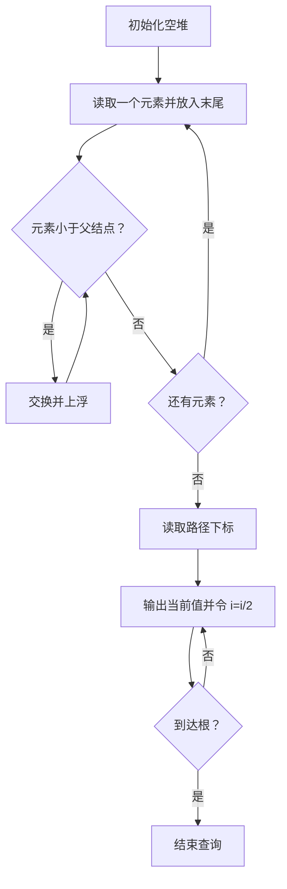
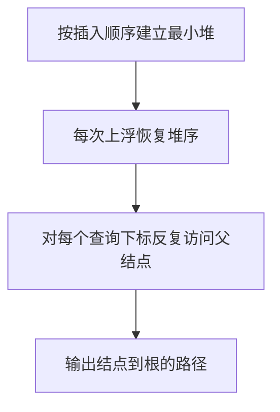

## 7-5 堆中的路径

- **分值：** 25分

## 题目描述

将一系列给定数字插入一个初始为空的最小堆 h。随后对任意给定的下标 i，打印从第 i 个结点到根结点的路径。

## 输入格式

每组测试第 1 行包含 2 个正整数 n 和 m (\le 10^3)，分别是插入元素的个数、以及需要打印的路径条数。下一行给出区间 [-10^4, 10^4] 内的 n 个要被插入一个初始为空的小顶堆的整数。最后一行给出 m 个下标。

## 输出格式

对输入中给出的每个下标 i，在一行中输出从第 i 个结点到根结点的路径上的数据。数字间以 1 个空格分隔，行末不得有多余空格。

## 输入样例
```
5 3
46 23 26 24 10
5 4 3
```

## 输出样例
```
24 23 10
46 23 10
26 10
```

## 解题思路

使用数组表示最小堆。插入新值到末尾后不断与父结点比较并上浮，直到父值不大于它或到达根。路径查询时从下标 `i` 开始，反复输出当前值并令 `i = i / 2`。

## 代码流程说明

1. 读取题目要求的输入并建立必要的数据结构。
2. 按上述算法处理数据，维护中间结果和边界条件。
3. 按题目规定的顺序与格式输出结果。

## 代码实现

```java
// 实现原理：使用数组表示最小堆。插入新值到末尾后不断与父结点比较并上浮，直到父值不大于它或到达根。路径查询时从下标 i 开始，反复输出当前值并令 i = i / 2。
static class MinHeap {
  int[] h = new int[1005];
  int size;

  void add(int x) {
    int i = ++size;
    while (i > 1 && x < h[i / 2]) {
      h[i] = h[i / 2];
      i /= 2;
    }
    h[i] = x;
  }

  String path(int i) {
    StringBuilder s = new StringBuilder();
    while (i > 0) {
      if (s.length() > 0) s.append(' ');
      s.append(h[i]);
      i /= 2;
    }
    return s.toString();
  }
}
```
## 代码流程图



## 解题流程图



## 复杂度分析

建堆时间 O(n log n)，每条路径查询 O(log n)，总时间 O(n log n+m log n)，空间 O(n)。

## 常见易错点

- 堆通常从下标 1 开始；父结点下标是 `i/2`；输出方向是“查询结点到根”，不是根到查询结点；相等元素不必上浮。
- 输入规模较大时，应选择与数据范围匹配的复杂度和数值类型。
- 输出分隔符、换行和特殊结果必须严格遵循题目格式。
