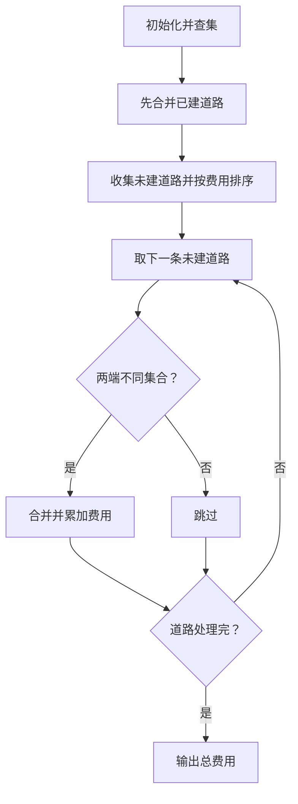
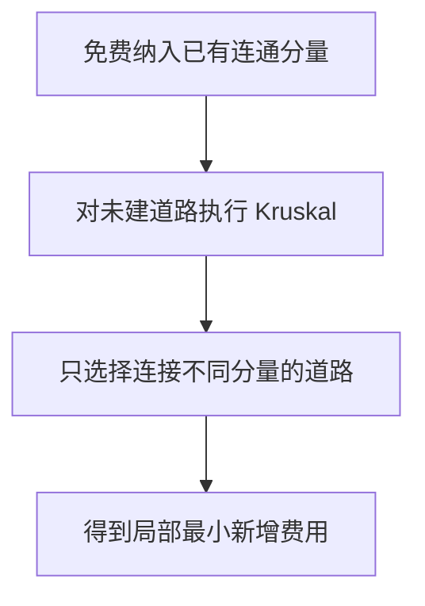

# 7-50 畅通工程之局部最小花费问题

- **分值：** 35分

## 题目描述

某地区经过对城镇交通状况的调查，得到现有城镇间快速道路的统计数据，并提出“畅通工程”的目标：使整个地区任何两个城镇间都可以实现快速交通（但不一定有直接的快速道路相连，只要互相间接通过快速路可达即可）。现得到城镇道路统计表，表中列出了任意两城镇间修建快速路的费用，以及该道路是否已经修通的状态。现请你编写程序，计算出全地区畅通需要的最低成本。

## 输入格式

输入的第一行给出村庄数目$$N$$ ($$1\le N \le 100$$)；随后的$$N(N-1)/2$$行对应村庄间道路的成本及修建状态：每行给出4个正整数，分别是两个村庄的编号（从1编号到$$N$$），此两村庄间道路的成本，以及修建状态 — 1表示已建，0表示未建。

## 输出格式

输出全省畅通需要的最低成本。

## 输入样例
```
4
1 2 1 1
1 3 4 0
1 4 1 1
2 3 3 0
2 4 2 1
3 4 5 0
```

## 输出样例
```
3
```

### 解题思路

把已建道路视为初始连通关系，先用并查集合并状态为 1 的道路；再按未建道路成本升序进行 Kruskal，累加连接不同集合的最小成本。

### 代码流程说明

1. 读取题目要求的输入并建立必要的数据结构。
2. 按上述算法处理数据，维护中间结果和边界条件。
3. 按题目规定的顺序与格式输出结果。

### 代码实现

```java
static class DSU {
    int[] parent;
    DSU(int n) {
        parent = new int[n];
        for (int i = 0; i < n; i++) parent[i] = i;
    }
    int find(int x) {
        return parent[x] == x ? x : (parent[x] = find(parent[x]));
    }
    boolean union(int a, int b) {
        a = find(a); b = find(b);
        if (a == b) return false;
        parent[a] = b;
        return true;
    }
}

static long connectedCost(int n, int[][] roads) {
    DSU dsu = new DSU(n + 1);
    List<int[]> missing = new ArrayList<>();
    for (int[] e : roads) {
        if (e[3] == 1) dsu.union(e[0], e[1]);
        else missing.add(e);
    }
    missing.sort(Comparator.comparingInt(e -> e[2]));
    long answer = 0;
    for (int[] e : missing) if (dsu.union(e[0], e[1])) answer += e[2];
    return answer;
}
```
### 代码流程图



### 解题流程图



### 复杂度分析

候选道路数为 O(n²)，排序未建道路时间 O(n² log n)，空间 O(n²)。

### 常见易错点

- 已建道路不应再次计费；初始合并后可能已经全连通；道路总数为 N(N-1)/2，使用合适的数组和整数类型。
- 输入规模较大时，应选择与数据范围匹配的复杂度和数值类型。
- 输出分隔符、换行和特殊结果必须严格遵循题目格式。
