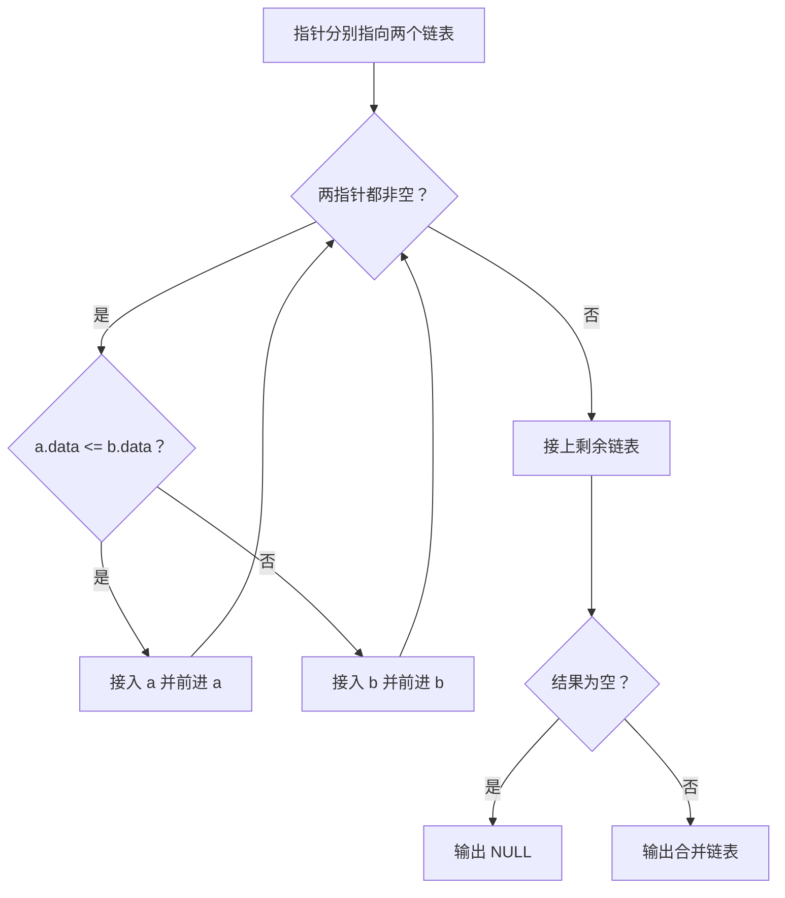
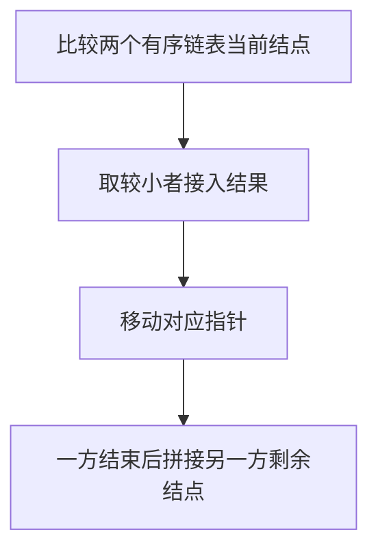

## 7-51 两个有序链表序列的合并

- **分值：** 20分

## 题目描述

已知两个非降序链表序列S1与S2，设计函数构造出S1与S2合并后的新的非降序链表S3。

## 输入格式

输入分两行，分别在每行给出由若干个正整数构成的非降序序列，用$$-1$$表示序列的结尾（$$-1$$不属于这个序列）。数字用空格间隔。

## 输出格式

在一行中输出合并后新的非降序链表，数字间用空格分开，结尾不能有多余空格；若新链表为空，输出`NULL`。

## 输入样例
```
1 3 5 -1
2 4 6 8 10 -1
```

## 输出样例
```
1 2 3 4 5 6 8 10
```

## 解题思路

两个链表均已按非降序排列，使用双指针比较当前结点，将较小者接到结果链表；一方耗尽后直接接入另一方剩余部分。

## 代码流程说明

1. 读取题目要求的输入并建立必要的数据结构。
2. 按上述算法处理数据，维护中间结果和边界条件。
3. 按题目规定的顺序与格式输出结果。

## 代码实现

```java
// 实现原理：两个链表均已按非降序排列，使用双指针比较当前结点，将较小者接到结果链表；一方耗尽后直接接入另一方剩余部分。
static class ListNode {
  int data;
  ListNode next;

  ListNode(int data) {
    this.data = data;
  }
}

static ListNode merge(ListNode a, ListNode b) {
  ListNode dummy = new ListNode(0), tail = dummy;
  while (a != null && b != null) {
    if (a.data <= b.data) {
      tail.next = new ListNode(a.data);
      a = a.next;
    } else {
      tail.next = new ListNode(b.data);
      b = b.next;
    }
    tail = tail.next;
  }
  while (a != null) {
    tail.next = new ListNode(a.data);
    tail = tail.next;
    a = a.next;
  }
  while (b != null) {
    tail.next = new ListNode(b.data);
    tail = tail.next;
    b = b.next;
  }
  return dummy.next;
}
```
## 代码流程图



## 解题流程图



## 复杂度分析

两个链表各扫描一次，时间 O(n+m)，新结果链表空间 O(n+m)。

## 常见易错点

- 相等元素不能错误去重；合并后要接上剩余链表；空链表输出 NULL；新结点的 Next 必须正确连接。
- 输入规模较大时，应选择与数据范围匹配的复杂度和数值类型。
- 输出分隔符、换行和特殊结果必须严格遵循题目格式。
