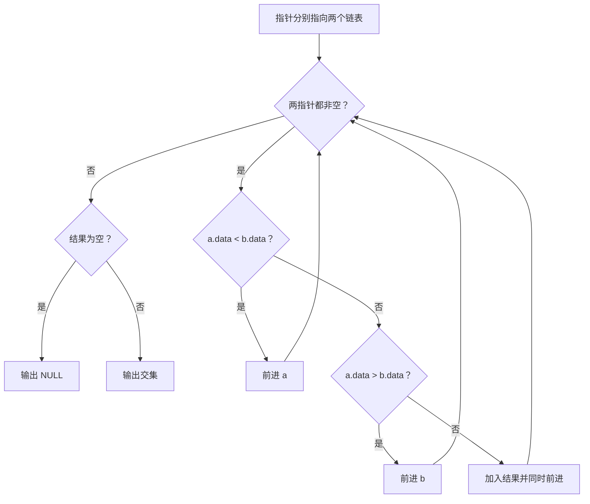
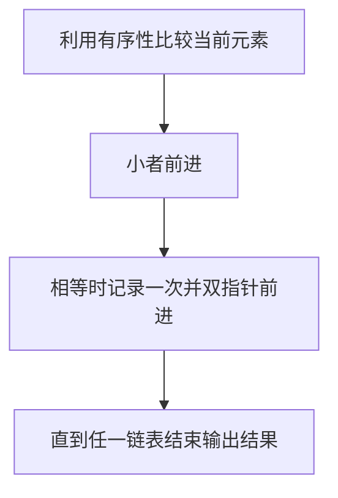

## 7-52 两个有序链表序列的交集

- **分值：** 20分

## 题目描述

已知两个非降序链表序列S1与S2，设计函数构造出S1与S2的交集新链表S3。

## 输入格式

输入分两行，分别在每行给出由若干个正整数构成的非降序序列，用$$-1$$表示序列的结尾（$$-1$$不属于这个序列）。数字用空格间隔。

## 输出格式

在一行中输出两个输入序列的交集序列，数字间用空格分开，结尾不能有多余空格；若新链表为空，输出`NULL`。

## 输入样例
```
1 2 5 -1
2 4 5 8 10 -1
```

## 输出样例
```
2 5
```

## 解题思路

使用两个有序链表的双指针。当前值相等时将其加入交集并同时前进；较小者前进，直到任一链表结束。这样天然保留重复值的匹配次数。

## 代码流程说明

1. 读取题目要求的输入并建立必要的数据结构。
2. 按上述算法处理数据，维护中间结果和边界条件。
3. 按题目规定的顺序与格式输出结果。

## 代码实现

```java
// 实现原理：使用两个有序链表的双指针。当前值相等时将其加入交集并同时前进；较小者前进，直到任一链表结束。这样天然保留重复值的匹配次数。
static class ListNode {
  int data;
  ListNode next;

  ListNode(int data) {
    this.data = data;
  }
}

static ListNode intersection(ListNode a, ListNode b) {
  ListNode dummy = new ListNode(0), tail = dummy;
  while (a != null && b != null) {
    if (a.data < b.data) a = a.next;
    else if (a.data > b.data) b = b.next;
    else {
      tail.next = new ListNode(a.data);
      tail = tail.next;
      a = a.next;
      b = b.next;
    }
  }
  return dummy.next;
}
```
## 代码流程图



## 解题流程图



## 复杂度分析

两个链表各扫描一次，时间 O(n+m)，结果空间 O(r)，r 为交集长度。

## 常见易错点

- 相等时两个指针都要前进；交集不是把所有小值复制过去；题目若按序列元素定义交集，要保留重复出现的匹配。
- 输入规模较大时，应选择与数据范围匹配的复杂度和数值类型。
- 输出分隔符、换行和特殊结果必须严格遵循题目格式。
