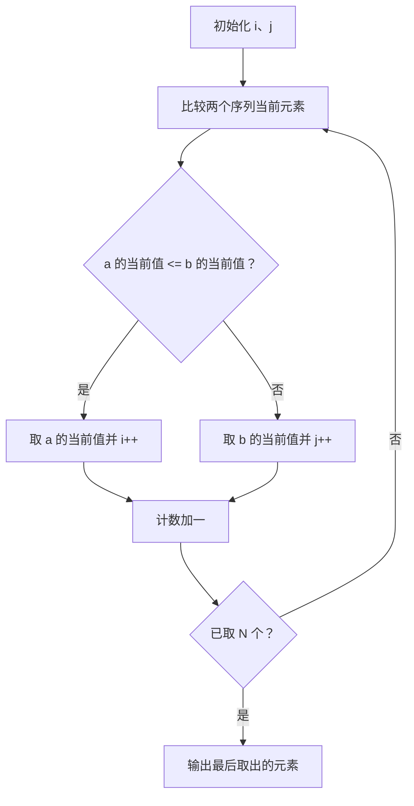
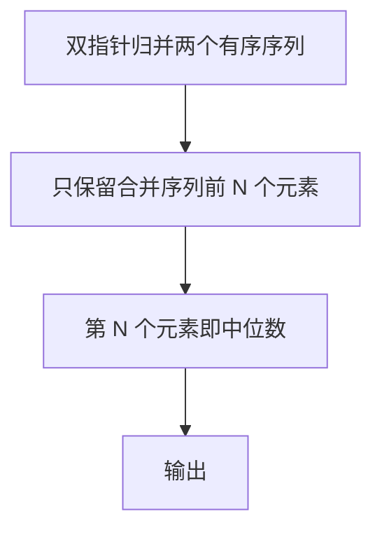

## 7-53 两个有序序列的中位数

- **分值：** 25分

## 题目描述

已知有两个等长的非降序序列S1, S2, 设计函数求S1与S2并集的中位数。有序序列A_0, A_1, \cdots, A_{N-1}的中位数指A_{(N-1)/2}的值,即第\lfloor(N+1)/2\rfloor个数（A_0为第1个数）。

## 输入格式

输入分三行。第一行给出序列的公共长度N（0<N\le100000），随后每行输入一个序列的信息，即N个非降序排列的整数。数字用空格间隔。

## 输出格式

在一行中输出两个输入序列的并集序列的中位数。

## 输入样例1
```
5
1 3 5 7 9
2 3 4 5 6
```

## 输出样例1
```
4
```

## 输入样例2
```
6
-100 -10 1 1 1 1
-50 0 2 3 4 5
```

## 输出样例2
```
1
```

## 解题思路

两个序列已经有序，使用双指针归并，只需找到并集中的第 N 个元素（下标 N-1），不必真正保存全部 2N 个元素。每次比较两个当前元素并移动较小者。

## 代码流程说明

1. 读取题目要求的输入并建立必要的数据结构。
2. 按上述算法处理数据，维护中间结果和边界条件。
3. 按题目规定的顺序与格式输出结果。

## 代码实现

```java
// 实现原理：两个序列已经有序，使用双指针归并，只需找到并集中的第 N 个元素（下标 N-1），不必真正保存全部 2N 个元素。每次比较两个当前元素并移动较小者。
static int median(int[] a, int[] b) {
  int i = 0, j = 0, current = 0;
  for (int count = 0; count < a.length; count++) {
    if (i < a.length && (j >= b.length || a[i] <= b[j])) current = a[i++];
    else current = b[j++];
  }
  return current;
}
```
## 代码流程图



## 解题流程图



## 复杂度分析

只归并到第 N 个元素，时间 O(N)，额外空间 O(1)。

## 常见易错点

- 中位数是合并后第 N 个数，不是两个序列各自中位数的平均值；相等时移动任一指针但必须只移动一个；注意 N 为偶数时仍取下标 N-1。
- 输入规模较大时，应选择与数据范围匹配的复杂度和数值类型。
- 输出分隔符、换行和特殊结果必须严格遵循题目格式。
