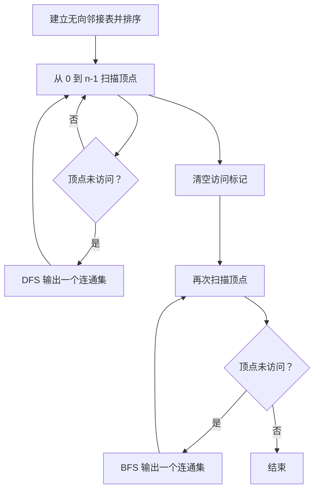
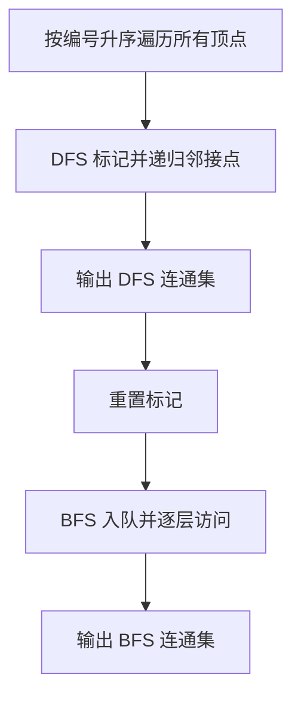

# 7-6 列出连通集

- **分值：** 25分

## 题目描述

给定一个有 $$n$$ 个顶点和 $$m$$ 条边的无向图，请用深度优先遍历（DFS）和广度优先遍历（BFS）分别列出其所有的连通集。假设顶点从 0 到 $$n-1$$ 编号。进行搜索时，假设我们总是从编号最小的顶点出发，按编号递增的顺序访问邻接点。

## 输入格式

输入第 1 行给出 2 个整数 $$n$$ ($$0<n\le 10$$) 和 $$m$$，分别是图的顶点数和边数。随后 $$m$$ 行，每行给出一条边的两个端点。每行中的数字之间用 1 空格分隔。

## 输出格式

按照"{ $$v_1$$ $$v_2$$ ... $$v_k$$ }"的格式，每行输出一个连通集。先输出 DFS 的结果，再输出 BFS 的结果。

## 输入样例
```
8 6
0 7
0 1
2 0
4 1
2 4
3 5
```

## 输出样例
```
{ 0 1 4 2 7 }
{ 3 5 }
{ 6 }
{ 0 1 2 7 4 }
{ 3 5 }
{ 6 }
```

### 解题思路

建立邻接矩阵或邻接表，并按顶点编号升序保存邻接点。DFS 使用递归，BFS 使用队列；每次从尚未访问的最小编号顶点启动一次遍历，即可得到全部连通集。

### 代码流程说明

1. 读取题目要求的输入并建立必要的数据结构。
2. 按上述算法处理数据，维护中间结果和边界条件。
3. 按题目规定的顺序与格式输出结果。

### 代码实现

```java
static void dfs(int v, List<Integer>[] g, boolean[] vis, List<Integer> out) {
    vis[v] = true;
    out.add(v);
    for (int u : g[v]) if (!vis[u]) dfs(u, g, vis, out);
}

static List<Integer> bfs(int start, List<Integer>[] g, boolean[] vis) {
    List<Integer> out = new ArrayList<>();
    ArrayDeque<Integer> q = new ArrayDeque<>();
    q.offer(start);
    vis[start] = true;
    while (!q.isEmpty()) {
        int v = q.poll();
        out.add(v);
        for (int u : g[v]) if (!vis[u]) {
            vis[u] = true;
            q.offer(u);
        }
    }
    return out;
}
```
### 代码流程图



### 解题流程图



### 复杂度分析

一次 DFS 或 BFS 为 O(n+m)，空间 O(n+m)。

### 常见易错点

- 无向边必须加入两个方向；遍历邻接点前排序；DFS 与 BFS 要分别清空访问标记；集合之间和元素之间的空格格式要严格匹配。
- 输入规模较大时，应选择与数据范围匹配的复杂度和数值类型。
- 输出分隔符、换行和特殊结果必须严格遵循题目格式。
