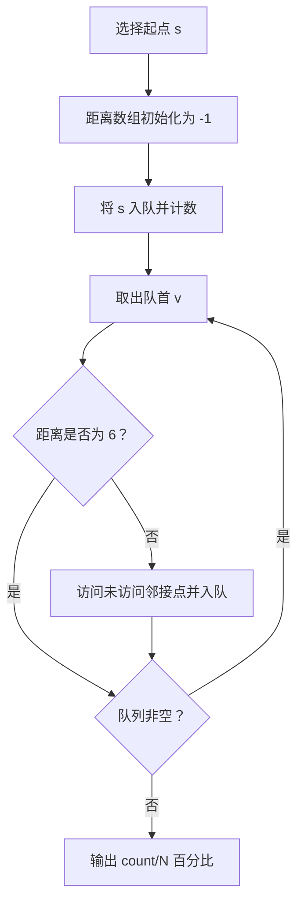
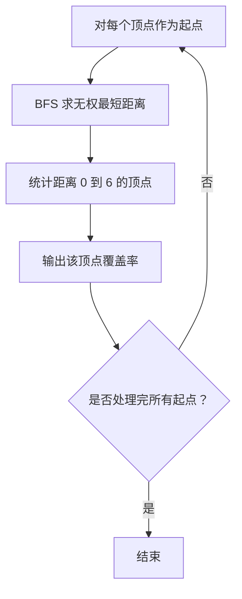

# 7-7 六度空间

- **分值：** 30分

## 题目描述

“六度空间”理论又称作“六度分隔（Six Degrees of Separation）”理论。这个理论可以通俗地阐述为：“你和任何一个陌生人之间所间隔的人不会超过六个，也就是说，最多通过五个人你就能够认识任何一个陌生人。”如图1所示。

<center>
<br>
图1  六度空间示意图</center>

“六度空间”理论虽然得到广泛的认同，并且正在得到越来越多的应用。但是数十年来，试图验证这个理论始终是许多社会学家努力追求的目标。然而由于历史的原因，这样的研究具有太大的局限性和困难。随着当代人的联络主要依赖于电话、短信、微信以及因特网上即时通信等工具，能够体现社交网络关系的一手数据已经逐渐使得“六度空间”理论的验证成为可能。

假如给你一个社交网络图，请你对每个节点计算符合“六度空间”理论的结点占结点总数的百分比。

## 输入格式

输入第1行给出两个正整数，分别表示社交网络图的结点数$$N$$（$$1<N\le 10^3$$，表示人数）、边数$$M$$（$$\le 33\times N$$，表示社交关系数）。随后的$$M$$行对应$$M$$条边，每行给出一对正整数，分别是该条边直接连通的两个结点的编号（节点从1到$$N$$编号）。

## 输出格式

对每个结点输出与该结点距离不超过6的结点数占结点总数的百分比，精确到小数点后2位。每个结节点输出一行，格式为“结点编号:（空格）百分比%”。

## 输入样例
```
10 9
1 2
2 3
3 4
4 5
5 6
6 7
7 8
8 9
9 10
```

## 输出样例
```
1: 70.00%
2: 80.00%
3: 90.00%
4: 100.00%
5: 100.00%
6: 100.00%
7: 100.00%
8: 90.00%
9: 80.00%
10: 70.00%
```

### 解题思路

对每个顶点执行一次 BFS，统计距离不超过 6 的顶点数。BFS 到达距离 6 后不再扩展；图无权，因此第一次访问某点时得到的就是最短距离。

### 代码流程说明

1. 读取题目要求的输入并建立必要的数据结构。
2. 按上述算法处理数据，维护中间结果和边界条件。
3. 按题目规定的顺序与格式输出结果。

### 代码实现

```java
static int withinSix(int start, List<Integer>[] g) {
    int[] d = new int[g.length];
    Arrays.fill(d, -1);
    ArrayDeque<Integer> q = new ArrayDeque<>();
    d[start] = 0;
    q.offer(start);
    int count = 1;
    while (!q.isEmpty()) {
        int v = q.poll();
        if (d[v] == 6) continue;
        for (int u : g[v]) if (d[u] < 0) {
            d[u] = d[v] + 1;
            count++;
            q.offer(u);
        }
    }
    return count;
}
```
### 代码流程图



### 解题流程图



### 复杂度分析

单个起点的 BFS 为 O(n+m)，空间 O(n)。

### 常见易错点

- 距离 6 的顶点应计数但不能继续扩展；无向边要双向加入；百分比按题目要求保留两位小数。
- 输入规模较大时，应选择与数据范围匹配的复杂度和数值类型。
- 输出分隔符、换行和特殊结果必须严格遵循题目格式。
