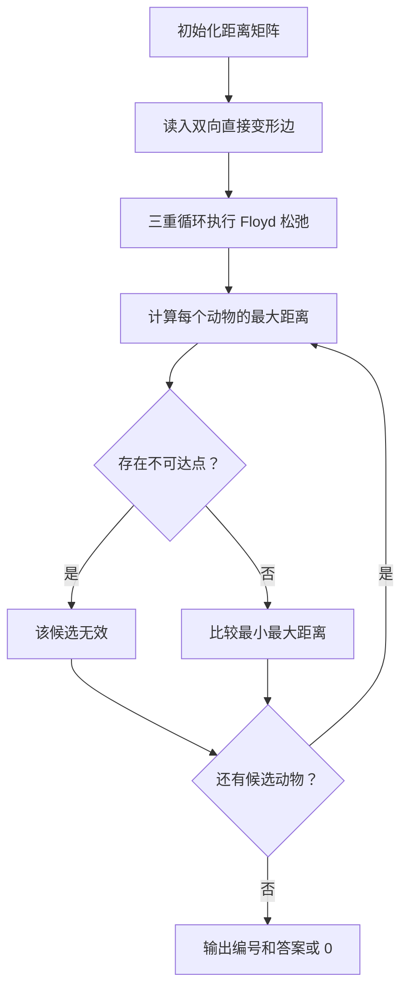
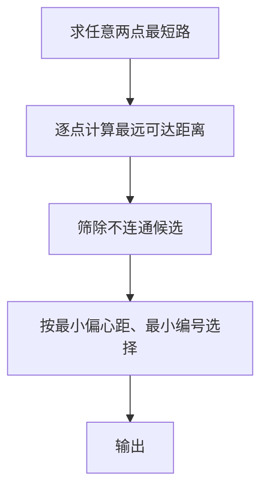

# 7-8 哈利·波特的考试

- **分值：** 25分

## 题目描述

哈利·波特要考试了，他需要你的帮助。这门课学的是用魔咒将一种动物变成另一种动物的本事。例如将猫变成老鼠的魔咒是 haha，将老鼠变成鱼的魔咒是 hehe 等等。反方向变化的魔咒就是简单地将原来的魔咒倒过来念，例如 ahah 可以将老鼠变成猫。另外，如果想把猫变成鱼，可以通过念一个直接魔咒 lalala，也可以将猫变老鼠、老鼠变鱼的魔咒连起来念：hahahehe。

现在哈利·波特的手里有一本教材，里面列出了所有的变形魔咒和能变的动物。老师允许他自己带一只动物去考场，要考察他把这只动物变成任意一只指定动物的本事。于是他来问你：带什么动物去可以让最难变的那种动物（即该动物变为哈利·波特自己带去的动物所需要的魔咒最长）需要的魔咒最短？例如：如果只有猫、鼠、鱼，则显然哈利·波特应该带鼠去，因为鼠变成另外两种动物都只需要念 4 个字符；而如果带猫去，则至少需要念 6 个字符才能把猫变成鱼；同理，带鱼去也不是最好的选择。

## 输入格式

输入说明：输入第 1 行给出两个正整数 $$n$$ ($$\le 100$$)和 $$m$$，其中 $$n$$ 是考试涉及的动物总数，$$m$$ 是用于直接变形的魔咒条数。为简单起见，我们将动物按 1 ~ $$n$$ 编号。随后 $$m$$ 行，每行给出了 3 个正整数，分别是两种动物的编号、以及它们之间变形需要的魔咒的长度($$\le 100$$)，数字之间用空格分隔。

## 输出格式

输出哈利·波特应该带去考场的动物的编号、以及最长的变形魔咒的长度，中间以空格分隔。如果只带1只动物是不可能完成所有变形要求的，则输出 0。如果有若干只动物都可以备选，则输出编号最小的那只。

## 输入样例
```
6 11
3 4 70
1 2 1
5 4 50
2 6 50
5 6 60
1 3 70
4 6 60
3 6 80
5 1 100
2 4 60
5 2 80
```

## 输出样例
```
4 70
```

### 解题思路

用 Floyd-Warshall 求任意两种动物间的最短魔咒长度。对每个候选动物计算到其他动物的最大距离，选择最大值最小且编号最小的候选者；若存在不可达点则该候选者无效。

### 代码流程说明

1. 读取题目要求的输入并建立必要的数据结构。
2. 按上述算法处理数据，维护中间结果和边界条件。
3. 按题目规定的顺序与格式输出结果。

### 代码实现

```java
static int[][] floyd(int n, int[][] edges) {
    final int INF = 1 << 29;
    int[][] d = new int[n][n];
    for (int i = 0; i < n; i++) {
        Arrays.fill(d[i], INF);
        d[i][i] = 0;
    }
    for (int[] e : edges) d[e[0]][e[1]] = d[e[1]][e[0]] = e[2];
    for (int k = 0; k < n; k++)
        for (int i = 0; i < n; i++)
            for (int j = 0; j < n; j++)
                d[i][j] = Math.min(d[i][j], d[i][k] + d[k][j]);
    return d;
}
```
### 代码流程图



### 解题流程图



### 复杂度分析

Floyd 时间 O(n³)，距离矩阵空间 O(n²)。

### 常见易错点

- 无向边必须双向更新；Floyd 相加前要避免无穷大溢出；存在不可达动物时不能把无穷大当作正常答案。
- 输入规模较大时，应选择与数据范围匹配的复杂度和数值类型。
- 输出分隔符、换行和特殊结果必须严格遵循题目格式。
