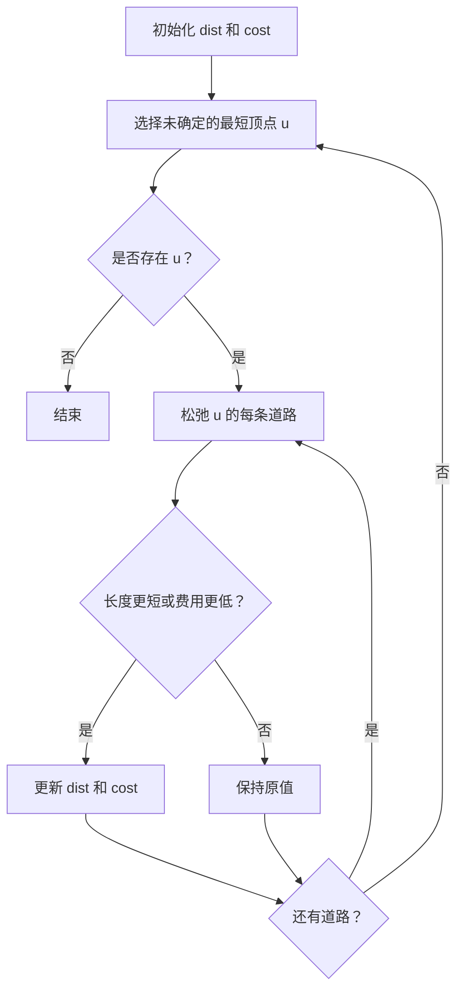
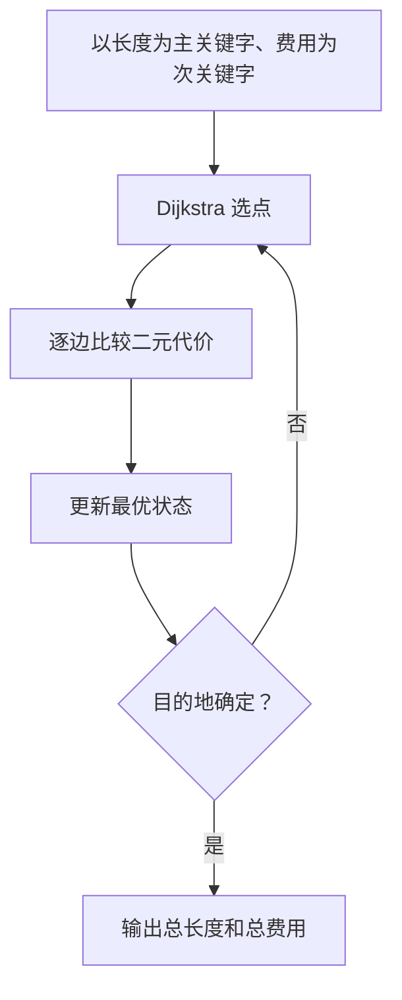

## 7-9 旅游规划

- **分值：** 25分

## 题目描述

有了一张自驾旅游路线图，你会知道城市间的高速公路长度、以及该公路要收取的过路费。现在需要你写一个程序，帮助前来咨询的游客找一条出发地和目的地之间的最短路径。如果有若干条路径都是最短的，那么需要输出最便宜的一条路径。

## 输入格式

输入说明：输入数据的第 1 行给出 4 个正整数 $$n$$、$$m$$、$$s$$、$$d$$，其中 $$n$$（$$2\le n\le 500$$）是城市的个数，顺便假设城市的编号为 0~($$n-1$$)；$$m$$ 是高速公路的条数；$$s$$ 是出发地的城市编号；$$d$$ 是目的地的城市编号。随后的 $$m$$ 行中，每行给出一条高速公路的信息，分别是：城市 1、城市 2、高速公路长度、收费额，中间用空格分开，数字均为整数且不超过 500。输入保证解的存在。

## 输出格式

在一行里输出路径的长度和收费总额，数字间以空格分隔，输出结尾不能有多余空格。

## 输入样例
```
4 5 0 3
0 1 1 20
1 3 2 30
0 3 4 10
0 2 2 20
2 3 1 20
```

## 输出样例
```
3 40
```

## 解题思路

这是带次关键字的最短路问题。Dijkstra 以 `(总长度, 总费用)` 作为比较依据：长度更短优先，长度相同则费用更低。每次松弛同时更新两个代价。

## 代码流程说明

1. 读取题目要求的输入并建立必要的数据结构。
2. 按上述算法处理数据，维护中间结果和边界条件。
3. 按题目规定的顺序与格式输出结果。

## 代码实现

```java
// 实现原理：这是带次关键字的最短路问题。Dijkstra 以 (总长度, 总费用) 作为比较依据：长度更短优先，长度相同则费用更低。每次松弛同时更新两个代价。
static long[] shortest(int n, List<long[]>[] g, int s, int t) {
  long INF = Long.MAX_VALUE / 4;
  long[] dist = new long[n], fee = new long[n];
  // 先统一设置初始状态，再在遍历中逐步更新可达结果。
  // 先统一设置初始状态，再在遍历中逐步更新可达结果。
// 先统一设置初始状态，再在遍历中逐步更新可达结果。
// 先统一设置初始状态，再在遍历中逐步更新可达结果。
  Arrays.fill(dist, INF);
  Arrays.fill(fee, INF);
  dist[s] = fee[s] = 0;
  boolean[] done = new boolean[n];
  for (int step = 0; step < n; step++) {
    int u = -1;
    for (int i = 0; i < n; i++)
      if (!done[i]
          && dist[i] < INF
          && (u < 0 || dist[i] < dist[u] || dist[i] == dist[u] && fee[i] < fee[u])) u = i;
    if (u < 0) break;
    done[u] = true;
    for (long[] e : g[u]) {
      int v = (int) e[0];
      long nd = dist[u] + e[1], nf = fee[u] + e[2];
      if (nd < dist[v] || nd == dist[v] && nf < fee[v]) {
        dist[v] = nd;
        fee[v] = nf;
      }
    }
  }
  return new long[] {dist[t], fee[t]};
}
```
## 代码流程图



## 解题流程图



## 复杂度分析

使用数组版 Dijkstra，时间 O(n²+m)，空间 O(n+m)。

## 常见易错点

- 不能只按费用排序；长度相同才比较费用；道路若为无向图需加入两个方向；使用整数类型保存累计值。
- 输入规模较大时，应选择与数据范围匹配的复杂度和数值类型。
- 输出分隔符、换行和特殊结果必须严格遵循题目格式。
